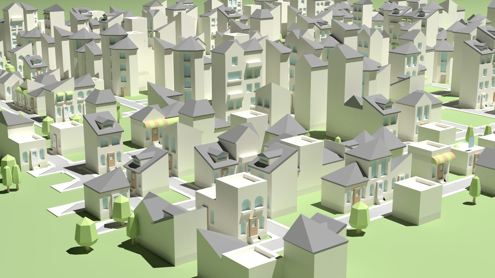
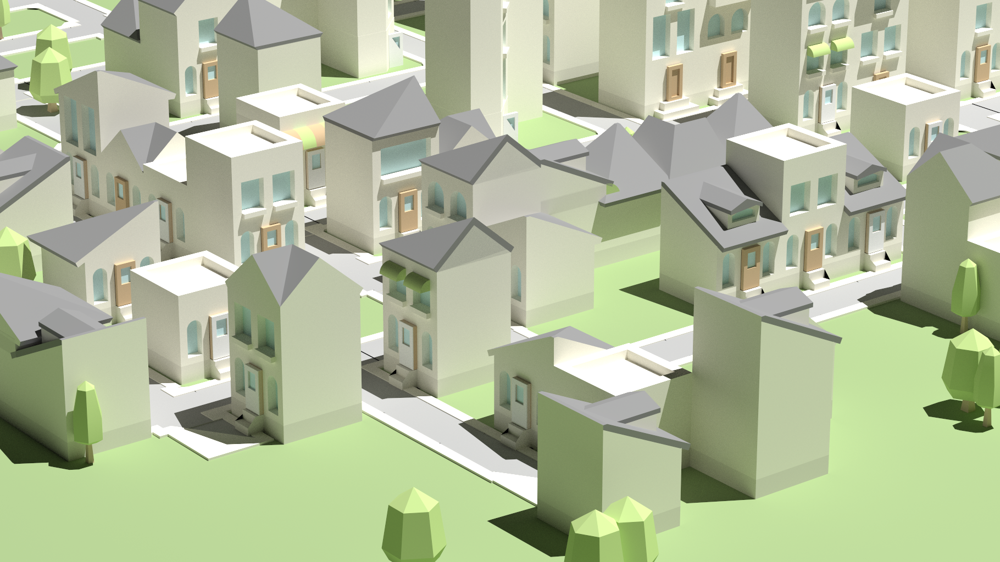
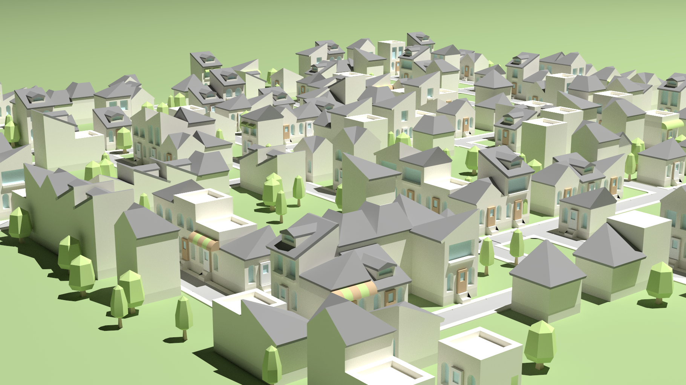
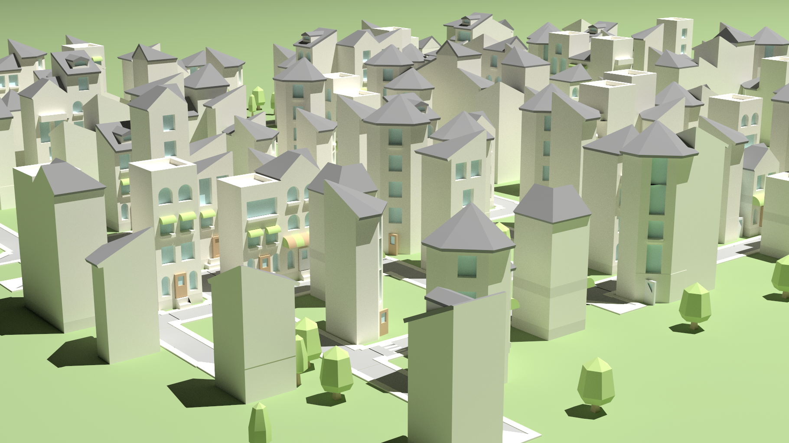
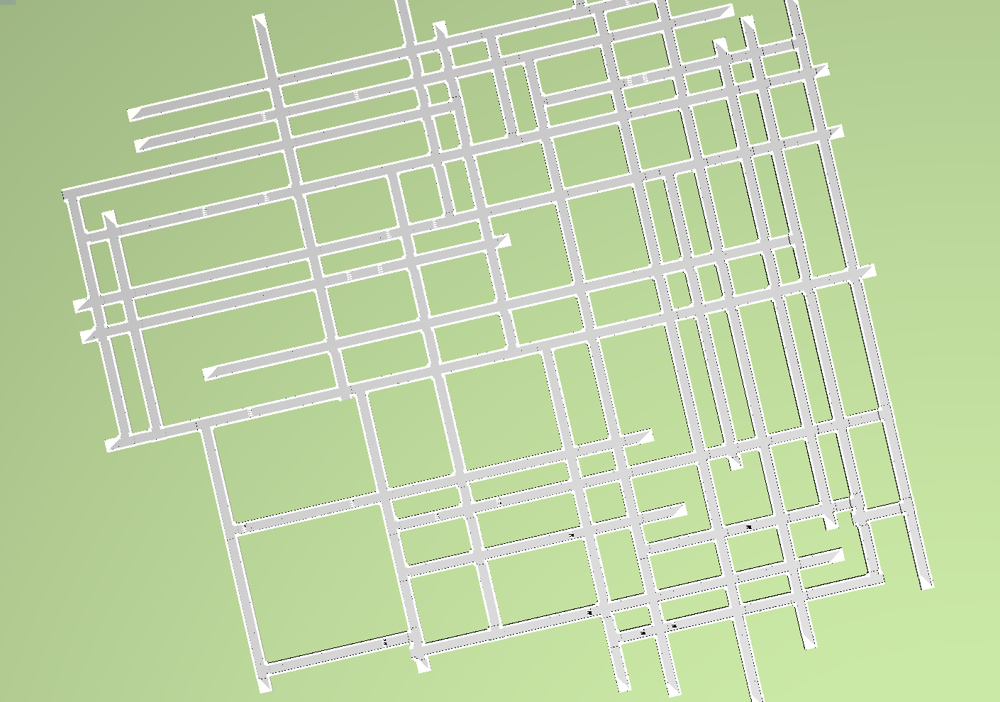
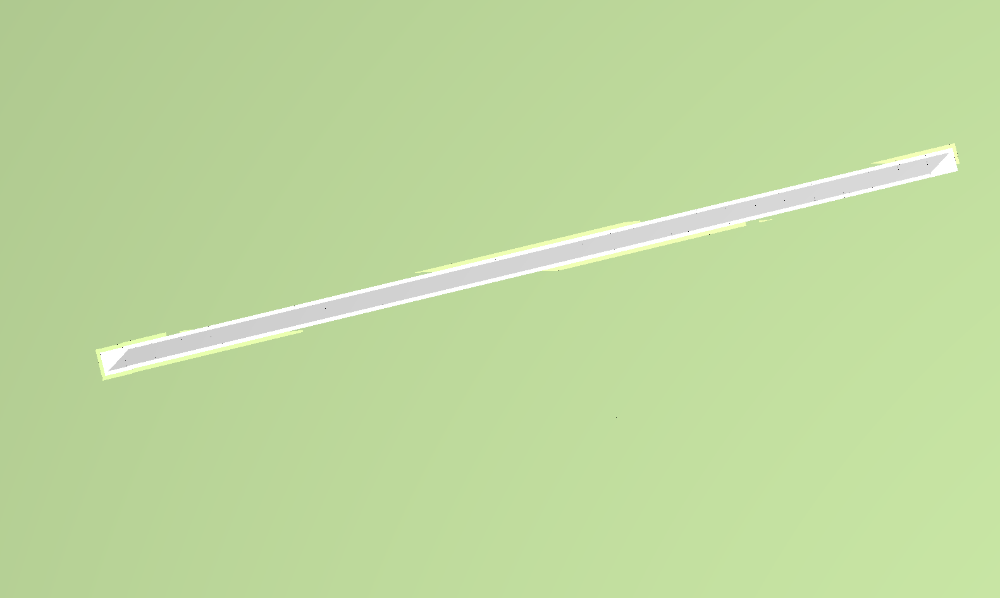
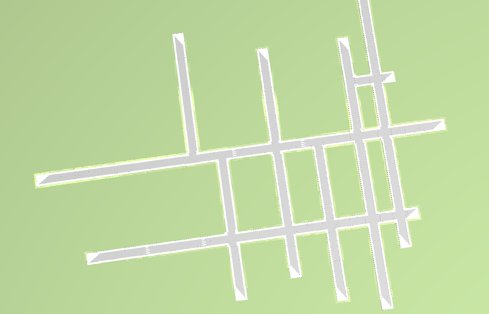

# City-Generator
This project is based on [Yocto/GL](https://github.com/xelatihy/yocto-gl) Library, introducing a random city generator. Features included:

- Random building and street generation
- Possibility to choose:
    - City size
    - Maximum number of floor of the buildings
    - How many the streets have to be forked
    - The chance to place a building
    - The chance to place trees
    - The urbanization (explained later)
    - Day or Sunset mode
- Saving the scene to Obj file

This generator creates a bidimensional matrix and populates it as follows. 
At the beginning roads are created by using a sort of random walk algorithm. The algorithm "walks" in a direction and for each step it has a certain probaility to fork in a perpendicular direction (or double fork). If it forks, it will "walk" in the new direction and the fork probability will be halved. When the road reaches the border of the matrix or in some other critical case (such as a street parallel to the one near it) it will stop and the algorithm will continue from the point where it forked. 
The result is a random road network that contains crossroads and can be more or less complex depending on the input fork-probability. 
After that we will have a matrix that contains the roads in order to let us place buildings and trees. The algorithm will then place buildings near the roads with the input of building-creation-probability, otherwise will place trees with the input of tree-creation-probability and will check the crossroads or the end of a road placing the right model.

In this way the buildings are recursively generated.  At each step a random floor, base or roof will be choosen, managing the compatibility between the models and the position of them.

The urbanization lets the user choose how the city will look like and if it will have only big buildings or small houses. Starting from the center of the city to the borders there will be more or less high buildings and trees depending on the value of the input urbanization.

The sunset mode is a special setting that will create a suggstive atmosphere making your generated-city look really cool.

## Outputs and generation parameters:

    
`./bin/city_generator -size 50 -sc 50 -bc 40 -u 80 -s`
    

    
`./bin/city_generator -size 50 -sc 50 -bc 35 -u 70 `

    
`./bin/city_generator -size 30 -sc 60 -bc 50 -u 70 `
    

    
`./bin/city_generator -size 30 -sc 60 -bc 50 -u 0 `

    
`./bin/city_generator -size 30 -sc 60 -bc 50 -u 100 `
    
You can find more examples in images folder.

## Building and Running:

Build:

    ./build.sh

Run:

    ./bin/city_generator
For the prerequisites look at [Yocto/GL](https://github.com/xelatihy/yocto-gl#compilation)
 
### Parameters:

- `-size int` to specify the size of the city `default = 30`

- `-m int` to specify the minimum number of floors of the buildings of the city `default = 1`

- `-M int` to specify the maximum number of floors of the buildings of the city `default = 5`

- `-sc int` to specify the probability for the roads to fork `default = 30`

- `-bc int` to specify the probability for a building to be placed `default = 50`

- `-tc int` to specify the probability for a tree to be placed `default = 30`

- `-u int` to specify the urbanization level of the city `default = 75`

- `-s` to activate the sunset mode

- `-o string` to specify the output filename where the scene will be saved `default = "scene_out.obj"`

Example:

    ./bin/city_generator -size 40 -tc 30 -sc 60 -bc 50 -u 70 -o generated_city.obj

### Street generation example:

The generation of the streets can be controlled by adjusting the `-sc` parameter. These are some outputs:

`with high split chance`
    

    
`with 0 as split chance`
    

    
`with default as split chance`
    
### Authors

[Andrei Stefan Bejgu](https://github.com/andreim14)
    
### Credits
[Fabio Pellacini](https://github.com/xelatihy) for the [Yocto/GL](https://github.com/xelatihy/yocto-gl) library.
